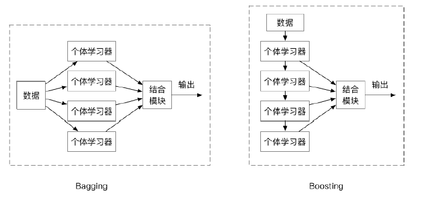
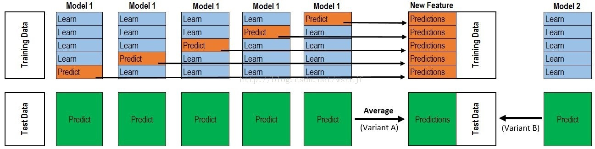
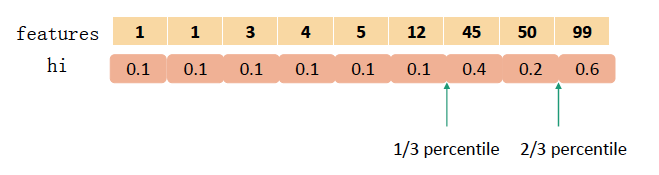
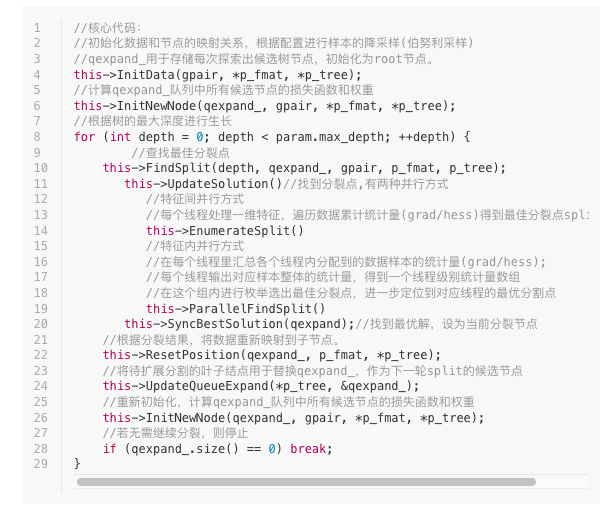
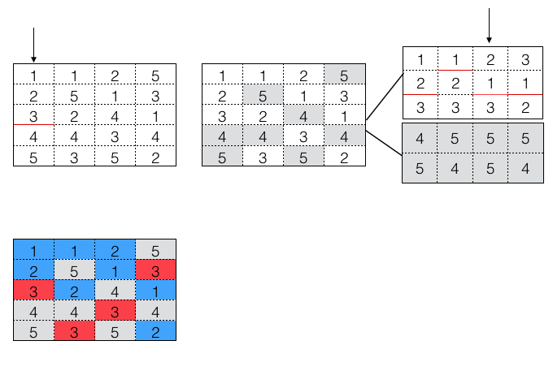

# Ensemble 集成学习：学渣们的逆袭之路

@Author: Tinkle G   @Created in 2018/3/9

---

## Ensemble 框架

1. 弱学习器和强学习器

强可学习：一个概念（一个类），如果存在一个多项式的学习算法能够学习到它，并且正确率很高，那么这个概念是强可学习的。

弱可学习：一个概念（一个类），如果存在一个多项式的学习算法能够学习到它，并且正确率仅比随机猜测略好（高于50%），那么这个概念是弱可学习的。

2. Ensemble集成学习

通过构建并结合多个弱学习器从而成为强学习器的过程。

基学习器（相同的个体学习器）的基本要求：“好而不同”（准确性、多样性）

构建和结合思路：多个学习器之间的连接方式、多个学习器输出结果的结合方式

3. 多个学习器间的连接方式

（1）Boosting：个体学习器间存在强依赖关系，必须串行生成的序列化方法。

（2）Bagging：个体学习器间不存在强依赖关系，可同时生成的并行化方法。

4. 多个学习器输出结果的结合方式

分类：简单投票、加权投票

回归：简单平均、加权平均

Stacking：初级学习器的输出会作为次级学习器的输入进行训练

  v

## 学习器并联模式：Bagging

### 简单的Bagging

关键词：有放回抽样，低方差

原始的Bagging的流程：以Bootstrap方式采样出T个含m个训练样本的采样集合，然后基于每个采样集训练出一个基学习器，再将这些基学习器进行结合。对预测输出进行结合时，Bagging通常对分类任务适用简单投票法，回归任务适用简单平均法。

Bagging的多样性来自于样本的扰动使得学习器的学习结果略有不同。

Q: 为什么Bagging能够降低方差？

A: Bagging中构造了n个模型，如果这些模型是一样的配置，那么具有相似的方差$\sigma ^2$

*if the varriables have equal variance $\sigma ^2$ and the average correlation of distinct variables is $\rho$, then the variance of their mean is*
$$
Var(\overline{X})=\frac{\sigma ^2}{n}+\frac{n-1}{n}\rho \sigma ^2
$$
因为Bagging训练数据是随机采样的，bagging方法得到的各子模型是有一定相关性的，各模型的分布也近似相同，但不独立，$\rho$介于[0,1]的两个极端状况的中间态，因此可以一定程度降低variance

### Random Forest 随机森林

关键词：决策树学习器、随机属性选择

RF在以**决策树**为基学习器构建Bagging集成的基础上，进一步在决策树的训练中，引入了**随机属性选择**，从决策树的每个节点中（假设当前有d个属性），随机选择一个包含k个属性选择最优属性。通常情况下取$k=log_2d$

RF的多样性来自于样本扰动和属性扰动。

Q: RF的算法步骤？

a. 随机选择样本（放回抽样）

b. 随机选择特征

c. 构建决策树

d. 投票（平均）

Q: RF和Bagging的对比？

A:  RF的起始性能往往相对较差，特别是在集成中只包含一个基学习器（因为通过引入属性扰动，随机森林中个体学习器的性能往往有所降低）。然而随着个体学习器数目的增加，随机森林通常会收敛到更低的泛化误差。此外，RF的训练效率常常优于Bagging，因为Bagging使用的是“确定型”的决策树，在选择划分属性时要对结点的所有属性进行考察而随机森林使用的是“随机型”的决策树，每次只需要考察确定的子集。

Q：RF的优缺点

[优点] 在数据集上表现良好，相对于其他算法有较大的优势（训练速度，预测准确度）；能够处理很高维的数据，无需特征选择，亦可给出特征重要性；容易做成并行化

[缺点] 在噪声较大的分类或者回归问题上容易过拟合

## 学习器的串联模式：Boosting

工作机制：根据基学习器的表现对**训练样本分布进行调整**从而将弱分类组成强分类器。

### Adaboost

Adaboost算法是“模型为加法模型、损失函数为指数函数、学习算法为前向分布算法”时的二类分类学习方法。

模型：$f(x)=\sum_{m=1}^M\alpha_mG_m(x)$

损失函数：$L(y,f(x))=exp[-yf(x)]$

拟解决两个问题（两个内容）

（1）改变训练数据的权值或概率分布（增大误分类样本的权值，放大为原来的$\frac{e_m}{1-e_m}$倍)
$$
w_{m+1,i}=\frac{w_{m,i}}{Z_m}exp(-\alpha_my_iG_m(x_i))
$$
其中$Z_m = \sum_{i=1}^Nw_{m,i}exp(-\alpha_my_iG_m(x_i))$为规范化因子

（2）加大分类误差小的弱分类器的权值
$$
\alpha_m=\frac{1}{2}log\frac{1-e_m}{e_m}
$$
其中$e_m$为分类误差率

Q：Adaboost的步骤？

第一步：初始化训练数据的权值分布，一开始赋予相同的权值1/N

第二步：多轮迭代

a. 用带权的训练集进行学习，得到基本的二分类器$G_m(x)$

b. 计算带权的分类误差率$e_m=\sum_{i=1}^Nw_{m,i}I(G_m(x_i)\neq y_i)$

c. 计算$G_m(x)$的系数$\alpha_m=\frac{1}{2}log\frac{1-e_m}{e_m}$

d. 更新训练数据集的权值分布$w_{m+1,i}=\frac{w_{m,i}}{Z_m}exp(-\alpha_my_iG_m(x_i))$

第三步：组合各个弱分类器$f(x)=\sum_{m=1}^M\alpha_mG_m(x)$

### Boosting Decision Tree 提升树

分类问题：以决策树为基学习器的Adaboost
回归问题：加法模型、前向分布算法、平方误差损失、决策树为基函数
关键点在于拟合当前模型的残差

Q：Boosting Decision Tree 的过程？

(1) 初始化$f_0(x)=0$

(2) 对$m=1,2,..,M$

​      a). 计算残差

​         $r_{mi}=y_i-f_{m-1}(x_i),i=1,..,N$

​      b).  拟合残差$r_{mi}$学习一个回归树，得到$T(x;\Theta_m)$

​      c). 更新 $f_m(x)=f_{m-1}(x)+T(x;\Theta m)$

(3) 得到回归问题提升树 $f_M(x)=\sum_{m=1}^MT(x;\Theta_m)$

#### GBDT: Gradient Boosting Decision Tree梯度提升决策树

利用最速下降的近似方法，即利用损失函数的负梯度在当前模型的值，作为回归问题中提升树算法的残差的近似值，拟合一个回归树。

Q：GBDT的过程

(1) 初始化 $f_0(x)=arg min_c \sum_{i=1}^NL(y_i,c)$

(2) 对$m=1,2,…,M$

​    a). 计算残差

​      $r_{mi}=-\frac{\partial L(y,f_{m-1}(x_i)}{\partial f_{m-1}(x_i)}$

​    b). 对$r_{mi}$拟合回归树，得到第m棵树的叶结点区域$R_{mj},j=1,2,...J$

​    c). 对$j=1,2,…,J$计算：

  	$c_{mj}=argmin_c \sum_{x_i\in R_{mj}}L(y_i,f_{m-1}(x_i)+c)$

​    d). 更新 $f_m(x) = f_{m-1}(x)+\sum_{j=1}^{J}c_{mj}I(x\in R_{mj})$

算法步骤解释：

1、初始化，估计使损失函数极小化的常数值，它是只有一个根节点的树，即c是一个常数值。

2、
（a）计算损失函数的负梯度在当前模型的值，将它作为残差的估计
（b）估计回归树叶节点区域，以拟合残差的近似值
（c）利用线性搜索估计叶节点区域的值，使损失函数极小化
（d）更新回归树

3、得到输出的最终模型 f(x)

Q: GBDT的参数调节

https://github.com/aarshayj/Analytics_Vidhya/blob/master/Articles/Parameter_Tuning_GBM_with_Example/GBM_Parameters.xlsx

-  用于提升的参数Boosting Parameters

>  learning rate: 学习率
>
>  n_estimators: 树的数量
>
>  subsample: 子采样比例（不放回抽样）减小可以降低方差

-  树的参数（即决策树中的参数）Tree-Specific Parameters

>  min_samples_split: 区分一个内部结点需要的最少的样本数
>
>  min_samples_leaf: 一个叶子结点所需要的最小样本数
>
>  min_weight_fraction_leaf: 一个叶节点的输入样本所需要的最小的加权分数。
>
>  max_depth:最大深度
>
>  max_leaf_nodes：最大叶子个数
>
>  max_features：最大特征树

备注：缓解过拟合就是min_ 调大，max_调小

-  其他参数Tree-Specific Parameters

>  loss: 损失函数
>
>  init: 
>
>  random_state:随机种子
>
>  verbose: 模型打印输出
>
>  warm_start:
>
>  presort:是否预分类

Q: GBDT的正则化方法？

like Adaboost：learning rate 调小

子采样比例：subsample [0.5,0.8]

决策树的参数

Q: GBDT的优缺点？

优点：能够灵活地处理各种类型的数据

在相对较少的调参时间下，准确度较高

缺点：由于Gradient Boosting基学习器之间存在串行关系，难以并行训练数据

不适合高维稀疏数据，特征>样本，使树深且过拟合

### XGBoost

XGBoost是一种加法模型，用前向分布算法进行学习。

xgboost其实目标和gbdt一样，每一步模型都是去**拟合残差**，也就是目标函数要最小化损失函数，不同在于gbdt的方法是利用损失函数的负梯度在当前模型的值作为残差的近似值，而xgboost同时利用了损失函数的一阶导和二阶导数的信息，此外还增加了正则项。

1. 目标函数的表达和求解

$$
OBj(\Theta) = L(\Theta)+\Omega(\Theta)
$$

前一项是损失函数，后一项是正则化项，XGBoost的目标函数可以写成
$$
L(\phi)=\sum_{i=1}^nl(\tilde y_i,y_i)+\sum_{j=1}^k\Omega(f_j)
$$
在第$t$次迭代时，有$L^{(t)}=\sum_{i=1}^nl(y_i,\tilde y_i^{(t-1)}+f_t(x_i))+\Omega (f_t)$

$y_i^{(t-1)}$进行二阶泰勒展开：
$$
L^{(t)}\simeq \sum_{i=1}^n l(y_i,\tilde y_i^{(t-1)})+\frac{\partial l(y_i,\tilde y_i^{(t-1)})}{\partial \tilde y_i^{(t-1)}}f_t(x_i)+\frac{\partial l(y_i,\tilde y_i^{(t-1)})}{\partial ^2  \tilde y_i^{(t-1)}}f_t^2(x_i)+\Omega (f_t)
$$
去掉常数项，写成
$$
\tilde L^{(t)}= \sum_{i=1}^n g_if_t(x_i)+\frac{1}{2}h_if_t^2(x_i)+\Omega (f_t)
$$
其中$g_i$和$h_i$为样本对应的一阶导和二阶导信息。

对于$\Omega (f_t)$，采用$\Omega(f)=\gamma T+\lambda ||w||^2$，$T$为叶子结点的个数，$w$为叶子结点的分数（也就是拟合的残差），XGBoost对叶子结点个数进行惩罚，相当于在训练过程进行了剪枝。

可以进一步转化为
$$
L^{(t)}=\sum_{j=1}^T[G_jw_j+\frac{1}{2}(H_j+\lambda)w_j^2]+\gamma T
$$
其中$G_j$表示归到j叶子节点的所有样本一阶导数之和，$H_j$是二阶导数

如果确定了树的结构，那么最优预测分数为$w_j^*=-\frac{G_j}{H_j+\lambda}$，最小损失为$L^*=-\frac{1}{2}\sum_{j=1}^T\frac{G_j^2}{H_j+\lambda}+\gamma T$

2. 回归树的学习策略

我们知道，决策树学习器的学习策略是使用信息增益（率）最大或者Gini最小作为准则，在每个叶子结点上选择最佳特征。在XGBoost中，$-\frac{G_j^2}{H_j+\lambda}$表示了每个叶子结点对总体损失的贡献，这个值要越小越好，所以$\frac{G_j^2}{H_j+\lambda}$要越大越好。

对于一个叶子结点的分裂，分裂前后的增益应该为
$$
Gain = \frac{G_L^2}{H_L+\lambda}+\frac{G_R^2}{H_R+\lambda}-\frac{(G_L+G_R)^2}{H_L+H_R+\lambda}-\gamma
$$
2.1 最优的分割点的选择

结合样本的二阶导信息$h_i$（作为权重）进行样本分位。

  

2.2 XGBoost的并行化

按照原始的做法，每层树结点的划分过程如下：

>For each leaf node: 
>
>​	For each feature:
>
>​		Sort the instances in the node by the feature value
>
>​		Linear scan to decide the best split on the feature
>
>​	Take the best split and do it

注意到有一步Sort the instance in the node by the feature value操作非常冗余，因为它用到了排序这个步骤，然而每个结点中样本的特征排序是一个必不可少的步骤（因为要确定最佳分割点）

XGBoost关于特征并行的核心代码如下：

   

简化下流程应该是：

>  Sort global instances first
>
>  For each feature:
>
>  ​       For each leaf node:
>
>  ​              Linear scan to decide the best split on the feature 
>
>  For each leaf node:
>
>  ​      Take the best split feature       

  

XGBoost在训练之前预先对数据进行了排序，保存为block结构。

上图是一个并行的示意图，5*4的矩阵表示5个样本4种特征，矩阵内的数字为样本编号1-5，自上往下按对应的特征大小升序排列。图中不同颜色表示样本属于不同节点。

(a)初始节点为空（或者说root），通过计算得到特征1为最优划分特征，其划分点在样本3和样本4对应的特征值之间，此时分裂成左节点（包括样本123），右节点（包括样本45）。

(b)特征并行，对于每个特征，自上而下进行扫描，根据样本所属快（即节点）把对应的特征值加到对应的桶中。分配完毕之后，计算每个特征每个块（结点）的最优分割点。（因为无须再次排序，节省很多时间）

(c)节点并行。对于每个节点（块），从左往右根据信息增益情况选择最优的特征，即特征3，其划分点在样本1和样本3对应的特征值之间

(d)样本并行。把每个样本按照划分分配到对应的节点中。

3. XGBoost缺失值处理

在很多现实业务数据中，训练数据x可能因为存在缺失值、太多0统计值、One-Hot-Encoding编码导致非常很稀疏。当特征出现缺失值时，XGBoost可以学习出默认的节点分裂方向。

具体做法为：XGBoost考虑两个方向、考虑当前方向，将缺失值归为另一个方向看最小损失降低量，最后挑信息增益最大的划分方向。

### LightGBM

LightGBM的出发点 : ".. for each feature, they need to scan all the data instances to estimate the information gain of all possible split points, which is very time consuming"

LightGBM的解决办法：

（1）从降低样本数量但是不改变样本分布的角度：Gradient-based One Side Sampling (GOSS)
借鉴了Adaboost的思想，在每一次迭代前，利用了GBDT中的样本梯度和误差的关系，对训练样本进行采样: 对误差大（梯度绝对值大）的数据保留；对误差小的数据采样一个子集，但给这个子集的数据一个权重(1-a)/b [a是大误差数据占比，b是小误差数据采样比率），让这个子集可以近似到误差小的数据的全集。这么采样出来的数据，既不损失误差大的样本，又在减少训练数据的同时不改变数据的分布，从而实现了在几乎不影响精度的情况下加速了训练。

（2）从降低特征数量的角度：Exclusive Feature Bundling (EFB)
在特征维度很大的数据上，特征空间一般是稀疏的。利用这个特征，我们可以无损地降低GBDT算法中需要遍历的特征数量，更确切地说，是降低构造特征直方图（训练GBDT的主要时间消耗）需要遍历的特征数量。

这里是利用到高维特征的稀疏性，不同特征的值可能是互斥的（不全不为0，哦这里需要再斟酌一下表达），然后企图吧这些互斥的特征捆绑（bundling）在一起。然后用贪心的方法求解（特征按照非零个数降序排列->计算冲突->选择捆绑或者新开一个) 捆绑的特征用偏置来识别。

|                                  | XGBoost                       | LightGBM                                 |
| -------------------------------- | ----------------------------- | ---------------------------------------- |
| 树分裂方法（Tree growth algorithm)     | Level-wise                    | Leaf-wise with max depth limitation      |
| 分裂搜索（Split search algorithm)     | Pre-sorted algorithm          | Histogram algorithm                      |
| 内存开销（Memory cost)                | 2 x #feature x #data x 4Bytes | 1 x #feature x # data x 1Bytes 无需为 pre-sorting 特征值存储额外的信息 |
| 计算分裂增益(Caculation of split gain) | O(#data x #feature)           | O(#bin x #feature)                       |
| 提升缓存命中率                          |                               |                                          |
| 稀疏优化                             |                               | 对于稀疏的特征仅仅需要 `O(2 * #non_zero_data)` 来建立直方图 |
| 类别特征值的最优分割                       |                               | 本的思想是根据训练目标的相关性对类别进行重排序。 更具体的说，根据累加值(`sum_gradient / sum_hessian`)重新对（类别特征的）直方图进行排序，然后在排好序的直方图中寻找最好的分割点。 |

对XGBoost做了计算改进

*  直方图算法：把连续的浮点特征值离散化成k个整数，同时构造一个宽度为k的直方图
*  直方图差加速：利用叶子结点和父结点的关系做直方图计算上的加速。一个叶子的直方图可以由它的父亲节点的直方图与它兄弟节点的直方图做差得到，提升一倍速度。
*  建树过程改进：相比于XGBoost同一层所有节点都分裂，最后剪枝，LightGBM选取具有最大增益的节点分裂，但是容易过拟合，需要通过max_depth限制
*  并行优化。

传统的特征并行

1. 垂直切分数据，每个worker只有部分特征
2. 每个worker找到局部最佳切分点（feature，threshold）
3. worker之间互相通信，找到全局最佳切分点
4. 具有全局最佳切分特征的worker进行节点分裂，然后广播
   切分后左右子树的instance indices
5. 其他worker根据广播的instance indices进行节点分裂

缺点：
• split finding计算复杂度O(#data)，当数据量大时会比较慢
• 网络通信代价大，需要广播instance indices

LightGBM的特征并行
每个worker保存所有数据集

1. 每个worker在其特征子集上寻找最佳切分点
2. worker之间互相通信，找到全局最佳切分点
3. 每个worker根据全局最佳切分点进行节点分裂

优点：避免广播instance indices，减小网络通信量
缺点：split finding计算复杂度没有减小
且当数据量比较大时，单个worker存储所有数据代价高

-  ​
-  ​

## 小结

Q: Bagging 和 Boosting 的区别？

Bagging采用均匀取样，而Boosting根据错误率取样。

Bagging的各个预测函数没有权重，而Boosting是有权重的。

Bagging的各个预测函数可以并行生成，而Boosing的各个预测函数只能顺序生成。

Bagging可以减少方差（解决过拟合），Boosting可以减小偏差（解决欠拟合）

为什么说bagging是减少variance，而boosting是减少bias（https://www.zhihu.com/question/26760839）

Q: XGBoost和GBDT的区别？

-  分类器的选择。传统GBDT以CART作为基分类器，xgboost还支持线性分类器，这个时候xgboost相当于带L1和L2正则化项的逻辑斯蒂回归（分类问题）或者线性回归（回归问题）。
-  优化方法。传统GBDT在优化时只用到一阶导数信息，xgboost则对代价函数进行了二阶泰勒展开，同时用到了一阶和二阶导数。顺便提一下，xgboost工具支持自定义代价函数，只要函数可一阶和二阶求导。
-  有无正则项。xgboost在代价函数里加入了正则项，用于控制模型的复杂度。正则项里包含了树的叶子节点个数、每个叶子节点上输出的score的L2模的平方和。从Bias-variance tradeoff角度来讲，正则项降低了模型的variance，使学习出来的模型更加简单，防止过拟合，这也是xgboost优于传统GBDT的一个特性。
-  学习率。Shrinkage（缩减），相当于学习速率（xgboost中的eta）。xgboost在进行完一次迭代后，会将叶子节点的权重乘上该系数，主要是为了削弱每棵树的影响，让后面有更大的学习空间。实际应用中，一般把eta设置得小一点，然后迭代次数设置得大一点。（补充：传统GBDT的实现也有学习速率）
-  列抽样（column subsampling）。xgboost借鉴了随机森林的做法，支持列抽样，不仅能降低过拟合，还能减少计算，这也是xgboost异于传统gbdt的一个特性。

-  对缺失值的处理。对于特征的值有缺失的样本，xgboost可以自动学习出它的分裂方向。
-  xgboost工具支持并行。boosting不是一种串行的结构吗?怎么并行的？注意xgboost的并行不是tree粒度的并行，xgboost也是一次迭代完才能进行下一次迭代的（第t次迭代的代价函数里包含了前面t-1次迭代的预测值）。xgboost的并行是在特征粒度上的。我们知道，决策树的学习最耗时的一个步骤就是对特征的值进行排序（因为要确定最佳分割点），xgboost在训练之前，预先对数据进行了排序，然后保存为block结构，后面的迭代中重复地使用这个结构，大大减小计算量。这个block结构也使得并行成为了可能，在进行节点的分裂时，需要计算每个特征的增益，最终选增益最大的那个特征去做分裂，那么各个特征的增益计算就可以开多线程进行。可并行的近似直方图算法。树节点在进行分裂时，我们需要计算每个特征的每个分割点对应的增益，即用贪心法枚举所有可能的分割点。当数据无法一次载入内存或者在分布式情况下，贪心算法效率就会变得很低，所以xgboost还提出了一种可并行的近似直方图算法，用于高效地生成候选的分割点。

## Reference

http://mlnote.com/2016/10/29/xgboost-code-review-with-paper/

http://zhanpengfang.github.io/418home.html

https://www.zhihu.com/question/41354392

https://arxiv.org/pdf/1603.02754.pdf

http://wepon.me/files/gbdt.pdf

李航《统计学习方法》

周志华《机器学习》

